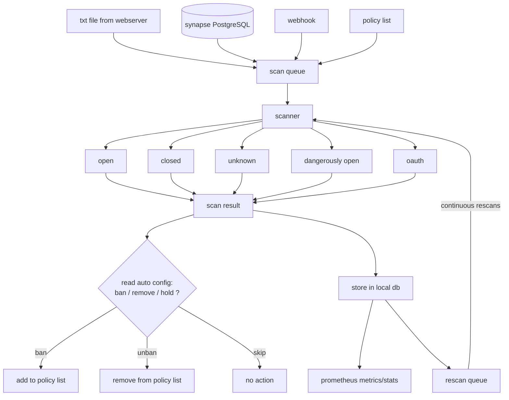
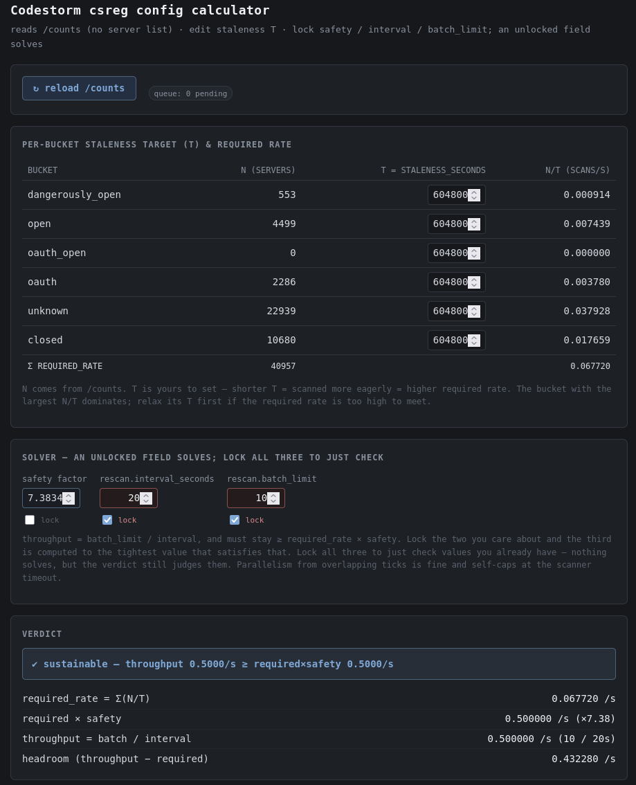
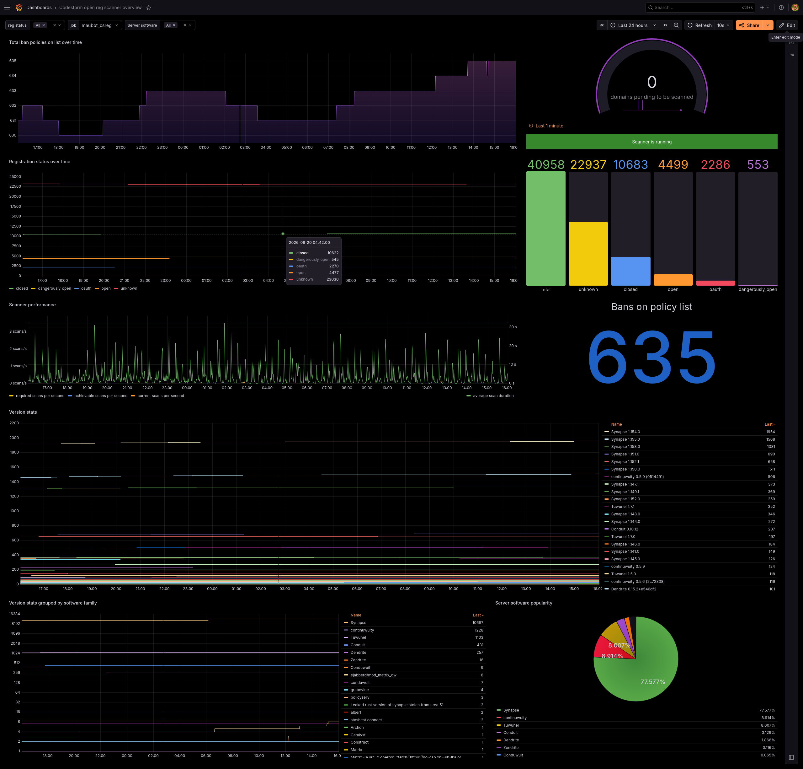

# Codestorm Open-Registration Matrix Server Scanner

A [maubot](https://github.com/maubot/maubot) plugin that automatically discovers
Matrix homeservers with dangerously open registration — for example, servers
that allow signup with no CAPTCHA or email verification — and automatically maintains a policy list based on that.

The main policy list for this project is [#cs-auto-open_reg:codestorm.net](https://matrix.to/#/#cs-auto-open_reg:codestorm.net)

For general support and discussion feel free to visit in [#cs-projects:codestorm.net](https://matrix.to/#/#cs-projects:codestorm.net)


This Project is developed with AI assistance.

## Contents

- [How it works](#how-it-works)
- [Quickstart](#quickstart)
- [Configuration](#configuration)
  - [Scanner](#scanner)
  - [Sources](#sources)
  - [Policy (auto_config)](#policy-auto_config)
  - [Tuning scan intervals](#tuning-scan-intervals)
- [Monitoring](#monitoring)

## How it works

Servers are ingested from one or more sources into a shared scan queue. The
scanner classifies each server's registration requirements, stores the result in a
local database, and (optionally) writes ban/unban rules to a Matrix policy list.
Known servers are continuously re-scanned so the entries dont go stale.



The bot is configured in two places:

- **YAML config** in the maubot web interface — sources, scan timing, metrics.
- **State events** in the policy-list room — which servers actually get banned
  (see [Policy (auto_config)](#policy-auto_config)).

## Quickstart

1. Download the `.mbp` file from this repo.
2. Upload it to your maubot instance.
3. Create a plugin instance and edit its config (see below).

## Configuration

### Scanner

We want to specify a per scan timeout to mitigate extremely slow servers or slowloris attacks:

```yaml
scanner:
  timeout_seconds: 150
```

This is the **total** time budget for scanning one server. Registration
classification runs first under that budget; the federation `/version` probe
then uses whatever wall-clock remains. Leaving it above ~120s is recommended.

### Sources

The bot has four ways to ingest servers. All sources feed the same shared scan
queue, and every source only ever *adds* — only the scanner drains the queue.

| Source | Use case |
| --- | --- |
| Text file | Generic newline/whitespace-separated list on a webserver |
| Postgres | Read server names directly from a Synapse database |
| Webhook | Push servers in via an authenticated HTTP endpoint |
| Policy list | Re-verify domains already in the policy list |

#### Text file

Expects a plain text file of server names, one per line:

```
server-a.example.org
server-b.example.org
server-c.example.org
```

This is the only source you can configure more than one of
(`sources.textfiles` is a list).

#### Postgres

Reads server names directly from a database. The intended use case is the
Synapse DB, which already holds a large list of known server names in the
`server_signature_keys` table.

Create a read-only user scoped to exactly that one table — that restricted role
is the real security boundary.

```sql
-- 1. Create the user (role)
CREATE USER cs_regscanner WITH PASSWORD 'change_me_to_a_strong_password';

-- 2. Connect to the target database
\c synapse

-- 3. Grant minimal access
--    PostgreSQL needs CONNECT on the database, USAGE on the schema,
--    and SELECT on the table.
GRANT CONNECT ON DATABASE synapse TO cs_regscanner;
GRANT USAGE ON SCHEMA public TO cs_regscanner;     -- adjust if not "public"
GRANT SELECT ON TABLE public.server_signature_keys TO cs_regscanner;
```

4. Edit `pg_hba.conf` to allow the new user to connect from wherever maubot
   runs.

#### Webhook

> **The webhook endpoint will not work without a configured `secret`.** Requests
> must carry an `Authorization: Bearer <secret>` header.

Send a JSON object with a `servers` key to (`POST` request)
`https://this.mau.bot/_matrix/maubot/plugin/<plugin-id>/ingest`:

```json
{"servers": ["example1.org", "example2.org", "matrix.example:8448"]}
```

A bare JSON array also works: `["example1.org", "example2.org"]`.

#### Policy list

When enabled, this reads domains from the configured policy list and adds them
back to the scan queue, so the bot independently re-verifies entries it never
discovered on its own. A server that fixes its registration then gets reconciled
back out of the list.

### Policy (auto_config)

Banning behaviour is controlled by a state event in the policy-list room (the
type is set by `auto_config_event_type`, default
`net.codestorm.csreg.auto_config`). This maps each classification to an action:

```json
{
    "schema_version": 1,
    "recommendation": "m.ban",
    "ban_reason": "open-reg",
    "default_action": "hold",
    "decision_map": {
        "dangerously_open": "ban",
        "open": "unban",
        "oauth": "unban",
        "oauth_open": "unban",
        "closed": "unban",
        "unknown": "hold"
    },
    "hold_targets": ["1.example.org", "2.example.org"],
    "write_policies_for_ip_literals": false
}
```

Anything not positively resolved to `ban` or `unban` falls through to `hold`
(no write). Until a valid `auto_config` event is present, policy writes stay
halted — the bot fails closed.

### Tuning scan intervals

During the initial ingest of thousands of domains it can help to temporarily
raise the `queue` settings in your bot yaml so the backlog clears quickly — but be careful not to
overload your network.


The trickiest part is tuning the re-scan options so re-scans keep up with the size
of your index without overloading your network.

A web calculator is provided to help:

```
https://your.mau.bot/_matrix/maubot/plugin/<plugin-id>/calc
```

It reads your live bucket counts and solves `rescan.interval_seconds` against
`rescan.batch_limit` for a staleness target you choose. If you'd rather not
tune, the defaults are fine.




## Monitoring

This bot exposes Prometheus metrics on its own listener at the address
configured under `metrics` (this is a standalone endpoint, **not** a path behind
maubot).<br> Point Prometheus at that address (for example `http://10.10.10.10:9337/metrics`).

A Grafana dashboard is included as `cs-regcheck-grafana.json`:
Import it into Grafana and point it at your Prometheus instance.



